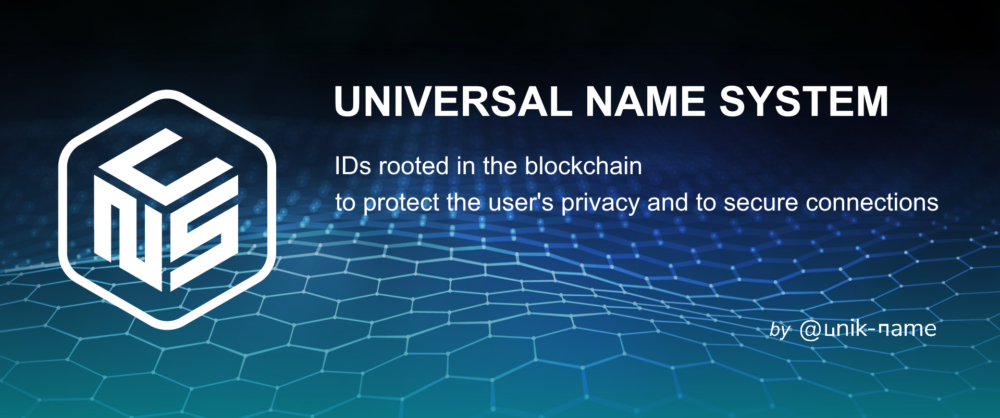

# uns.network Player Hub

<brand name="uns"/> is the blockchain and the protocol dedicated for sovereign IDs.

<p align="center">
    
</p>

> Official guides and documentation for the <brand name="uns"/> blockchain and protocol, powered by VuePress.

## Development

```
git clone https://github.com/unik-name/docs.uns.network
cd docs
yarn install
yarn docs:dev
```

Then open http://localhost:8080/

## Security

If you discover a security vulnerability within this package, please send an e-mail to security@<brand name="uns"/> All security vulnerabilities will be promptly addressed.

## Credits

- [Fabien Tréguer](https://github.com/ftreguer), from [@unikname's team](https://www.unikname.com)
- [Guillaume Nicolas](https://github.com/Nigui), from [@unikname's team](https://www.unikname.com)
- [Pierre Seznec](https://github.com/peterjah), from [@unikname's team](https://www.unikname.com)  
- [Damien Lecan](https://github.com/dlecan), from [@unikname's team](https://www.unikname.com)
- [Laurent Lourenco](https://www.linkedin.com/in/laurentlourenco/), from [@unikname's team](https://www.unikname.com)
- [All Contributors](../../../../contributors)

## License

[MIT](LICENSE) © [www.uns.network](https://www.uns.network) by [@unikname](https://www.unikname.com)
