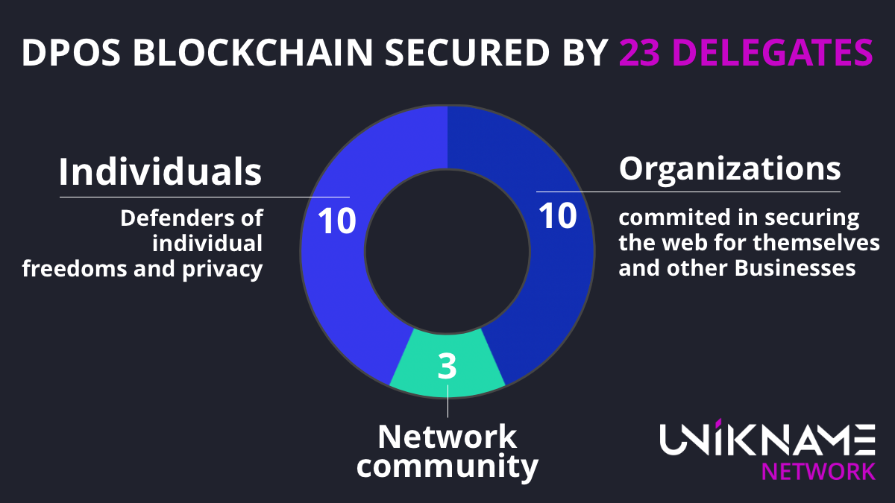

# Understanding governance of unikname.network blockchain 

::: warning
UNS/uns.network/universal-name-system is the old name of unikname.network blockchain.
UNIK is the old name of UNIKNAME nft token
UNS is the old name of UNIK protocol token
Urls, commands and old documentation are not renamed yet but are still valid. We're updating progressively.
:::

The unikname.network blockchain is a DPoS kind of blockchain.
It counts three separates categories of stakeholders, with specific purpose and interest.
They are:
- Organization: which makes secured the confidential connections on their web site
- Individual: which own UNIK credits
- Community actors which work for the network only

Therefore, governance is based on delegates colleges, allowing that all @unikname types to be represented.
Colleges are organized separately and independently.

Each network member can only vote for his own representatives according to rules specific to his college

In total, they are 23 actors securing the network by representing all spectrum of unikname.network stakeholders.
## Organizations

Organizations must vote.
At each time than a @unikname is created with organization type, it have to choose a representative.
It can be himself or another member of its college.
Each @unikname organization give its poll weighted by its subscription to the Unikname Connect solution. 
By this way, organization's delegates are the guarantors of the adequacy between the uns.network technology and Unikname Connect solution.

10 places are reserved for delegates with type organization.

## Individuals

Individuals vote only if they want it, but they are strongly encouraged to do it.
Between two delegates having capitalized the same number of credits among their votes, it will be the voters number who will settle them.
So individuals delegates guarantee network security on behalf the most involved users but also on in the name of the biggest part of them.

10 places are reserved for delegates with the type individual but if they are less than 10 organization delegates, until 10 more individual delegate can be elected.
However, as soon as organizations delegates will register, they will take places which are theirs by right.

## Networks

Networks delegates are appointed.
They are community delegates, registered during the blockchain inception.
They are exactly three: @uns+labs, @uns+bounty and @uns+support.

Their purpose is to boost innovations, issues corrections and activity in the community.
