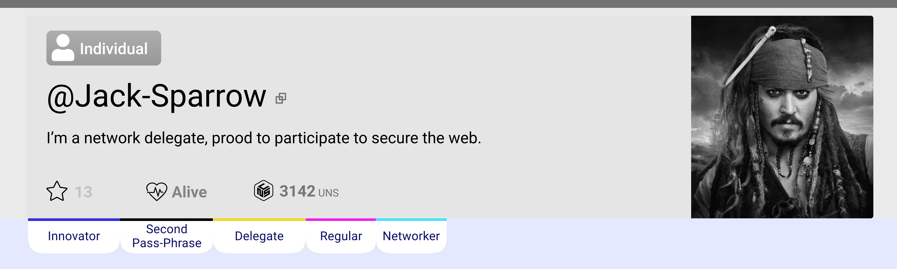
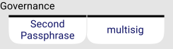
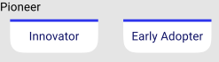
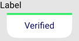
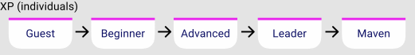

# Understanding Unikname Badges <Badge text="Key Concept"/>

**Table Of Content**
[[TOC]]

Each @unikname is assigned trust badges. They provide information on the qualities of each UNIKNAME DID and its involvement in the network.

<small>_example of badges displayed in the header section of @jack-sparrow_</small>

Badges take the form of On-Chain properties and are always Disclosed, regardless of the visibility of the UNIKNAME.

The badges are accessible with the Resolver within the path `/badges/`.

There are two types of badges, singular ones and enumerated ones, belonging to families.

The badges are returned by the APIs, the CLI, and are visible on the chain explorer and on My Unikname App.

The badges can be [claimed with the CLI](/cli.html#badges-claim) and with My Unikname App.

## Why Badges?

**First of all Badges contribute to build trust in the network**. They give indications on the quality and legitimacy of each existing @unikname ID within the network.

**In this spirit, Badges is a means to unlock Unikname features**.

## Badges List

### Governance

Badge Type: `boolean`

Property key `/Badges/Security/`

| Name | How to get it | Description | Scope | 
|-|-|-|-|
| **Second Passphrase** | forging the second passphrase transaction  | The UNIKNAME is attached to a wallet with a second passphrase | all types | 
| **Multisig** | forging the multisig transaction | The UNIKNAME is owned by a multisig cryptoaccount | all types | 

### Network Players Roles

Badge Type: `boolean`

Property key `/Badges/NP/`

| Name | How to get it | Description | Scope | 
|-|-|-|-|
| **Delegate** | Forging the `delegate registration transaction` | The cryptoaccount of the UNIKNAME is registered as Delegate | all types |
| **Storage Provider** | Getting licence* | The UNIKNAME is related to a Network Service Provider having a `Storage Provider Licence`. | all types |
| **NFT Factory** | Getting licence* | The UNIKNAME is related to a Network Service Provider having a `NFT Factory licence`. | network only |
| **URL Checker** | Getting licence* | The UNIKNAME is related to a Network Service Provider having a `URL Checker licence`. | network only |
| **AUTH Services** | Getting licence* | The UNIKNAME is related to a Network Service Provider having a `Auth Service licence`. | network only |

_* see [Network Service Providers](./service-provider)_

### Pioneer

Badge Type: `enumerate`

Property key `/Badges/Pioneer/`

| Name | How to get it | Description | Scope
|-|-|-|-|
| **Innovator** | Claim | Badge claimed before the end of 2020. | individual only
| **Early Adopter** | Claim | 2020 is ended and there is less than 150 000 UNIKNAME created in the chain when the badge is claimed. | individual only

### Label

Badge Type: `boolean`

Property key `/Badges/Label/`

| Name | How to get it | Description | scope 
|-|-|-|-|-|
| **Verified** | my-unikname App, with a coupon | The @unikname owner has provided contact information that have been verified | Organization only 

### Individuals eXPerience

Badge Type: `enumerate`

Property key `/Badges/XPLevel/`

| Name | How to get it | Description | Scope |
|-|-|-|-|-|
| **Newcomer** | Minting the UNIKNAME | The UNIKNAME has just been minted. | individual only
| **Beginner** | Claim within the App | - the @unikname has been created for 10000 blocks ago or more (~24h)   + lifecycle statuts activated   + local authentication activity  | individual only
| **Advanced** | Claim within the App | - has made 10 transactions and 10 contributions | individual only
| **Leader** | Claim within the App | - Has setup personnal properties   - has contributed to each Network Service Providers   - get the promoter badge | individual only
| **Maven** | Claim within the App |  - has made at least one connection  - Leader since 12 months.  Has voted for a delegate. | individual only

### Individuals Sponsorship

Type: `enumerate`

Property key `/Badges/Sponsorship/`

| Name | How to get it  | Description | Scope |
|-|-|-|-|-|
| **Promoter** | via sponsoring features | has invited 7 other user | individual only
| **Supporter** | via sponsoring features | has invited 7 users who created their @unikname becoming alive | individual only
| **Networker** | via sponsoring features | has invited 49 users who created their @unikname  becoming alive | individual only
| **Ambassador** | via sponsoring features | have been sponsor for 350 @unikname becoming alive | individual only
