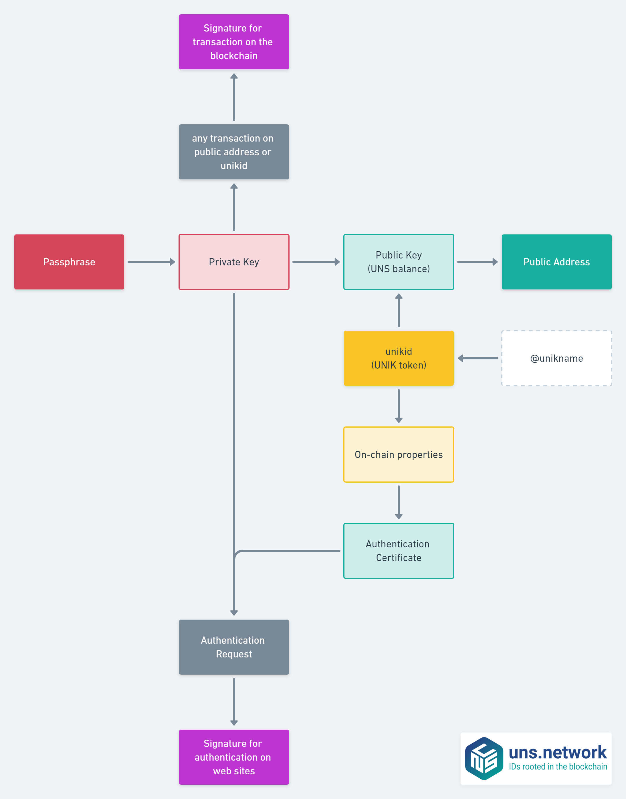

# Cryptography overview

In the blockchain world you must rely on cryptography to make it happends! <uns/> blockchain cryptography is based on [ARK.IO](https://ark.io) basics augmented with specificties related to Decentralized IDs and Decentralized Public Key Infrastructure requirements.

[[TOC]]

## Cryptoaccount

Traditional blockchain accounts are represented by a couple of public and private keys. These accounts handle a balance of fongible tokens (e.g. coin or utility token).

Within <uns/> we call these accounts the `cryptoaccounts` to be more meaningful. These cryptoaccounts are represented by a couple of a [PublicKey](#publickey) and [PrivateKey](#privatekey), and also by a public address and a passphrase.
The address is built via a combination of RIPEMD160 hashing and Base58Check encoding prefixed by a single network byte.

Then <uns/> cryptoaccounts handle both the UNS protocol tokens, and UNIK Non Fungible Tokens representing @unikname. They're protected and secured by a [passphrase](#passphrase).

## unikid

Every @unikname is encoded within the <uns/> blockchain with a hashcode, its `unikid`. Every unikid is "embedded" into a public key and can't exists without it. The unikid is the public part of a @unikname, the human-readable string representing a @unikname is not public, unless its owner decide to disclose it.

## Overview



## Resolving a cryptoaccount

Here is an example of the public address of a cryptoaccount on uns.network: `UVxGz3EKDqx4h8LLz2ao2GoDNPx4uHf25k`

For every public address there's a public key, associated with a private key, and encrypted with a passphrase. Here is an example of on-chain public informations available when you query this public address on uns.network.

```json
{
  "data": {
    "address": "UVxGz3EKDqx4h8LLz2ao2GoDNPx4uHf25k",
    "publicKey": "03c583c31c0ed365fecaf1dc88edd003e78d6bbded8923b355d878489284ea54ec",
    "secondPublicKey": "022b3d124aa60fb6ac0eb7576877a4c6197f8fd5aaa772f884c6269bf7829ba31e",
    "balance": 95,
    "token": "uns",
    "isDelegate": false,
    "vote": "02b43b9786808a4f415dbbdc5adab7e17bd0dde904d3dc6dd869bf11ae0f7a054d",
    "nfts": {
      "unik": 2
    },
    "tokens": {
      "unik": [
        "10e7052bbc0b914d4d9bb88db916a366258569b7e1b1c9e5c47cef2fc37deedb",
        "824387e6a9cf82caaea1b5fdc59af592f93d9dfea30c643cc3538def6a24b514"
      ]
    }
  }
}
```

Every @unikname has a single cryptoaccount, but a cryptoaccount can embed multiple @unikname.

:::tip
To know the cryptoaccount of a @unikname you can use the universal resolver.
:::

```bash
$ uns resolve @jack-sparrow?*
```
and
```bash
$ uns resolve @jack-sparow?*
```
return the same cryptoaccount in this example.

## Passphrase

The passphrase is the master password (key) for your UNS tokens and also for your UNIK tokens. Every UNS address has its own unique passphrase. With the passphrase you can sign transactions to send your UNS, you can manage your @unikname represented by UNIK tokens. More important is that the combination of your Passphrase plus a pincode or a fingerprint on your smartphone allow you to sign-in and sign-up everywhere.

So, do not lose your Passphrase, and do not share it with others. You could lose access to your UNS tokens but above all you could loose access to all website you're connected to. If you lose your passphrase, or if it is stolen, there is nothing we can do to help you. We CANNOT recover any lost passphrases.

The passphrase is used to directly calculate the [PrivateKey](#privatekey) of an UNS blockchain account and should never be shared, stored irresponsibly, or transmitted over the internet. The only person that should ever have access to a passphrase is the owner of its account.

We can technically use any word, phrase, or string as a passphrase which will result in a valid <uns/> cryptoaccount; however, it is heavily discouraged as the security of an address relies on the randomness of its Passphrase. Humans are bad at creating randomness, and entering sequences of random letters and numbers isn't easy to do accurately.

<uns/> passphrases are implemented using [ARK.IO cryptography](https://ark.dev/docs/core/transactions/cryptography#passphrase), based on the BIP39 Protocol, and is combination of twelve words.

## PrivateKey

A PrivateKey is a 256-bit integer represented by a 32-byte Hex-encoded string of 64 characters obtained via [SHA256 hashing](https://en.bitcoinwiki.org/wiki/SHA-256) of a [Passphrase](#passphrase).

To understand the significance of this large number, consider the following:

Passphrase:

```
"this is a top secret passphrase"
```

PrivateKey HEX \(base 16\) / SHA256 of Passphrase:

```
d8839c2432bfd0a67ef10a804ba991eabba19f154a3d707917681d45822a5712
```

PrivateKey DEC\(base 10 encoded\):

```
97932109907804210295451942024598204992707895659209392543371974078748689061650
```

The DEC representation is the "base 10" interpretation of our PrivateKey and gives us a little insight into the size of the numbers we're dealing with "under the hood". This large integer is also referred to as a "BigNumber" or UINT256.

## PublicKey

A PublicKey is like an ID or Passport. It is a mathematical proof of identity and is derived from a [PrivateKey](#privatekey) via [ECDSA](#ecdsa) or [SECP256K1](#secp256k1) computation.

<uns/> also uses "Point Compression" to obtain compressed PublicKeys that are 33-bytes in length.

### Network Prefixes

| Network | dec  | hex  | Prefix | Example address                    |
| :------ | ---- | :--: | :----: | ---------------------------------- |
| Livenet | 68   | 0x44 |   U    | UYWaMkArHJjMecuHgs6LYapFtvV27QeafX |
| Sandbox | 63   | 0x3F |   S    | SMoCXZbMHTBLFtg15GnRYuFyUFk2gt44zb |

### Signature

A Signature is essentially proof that a message or transaction was "signed" by a particular [PrivateKey](#privatekey) / [Passphrase](#passphrase).

Remember that this same PrivateKey also has a matching PublicKey. That means a Signature is computationally linked to its corresponding [PublicKey](#publickey) using [ECDSA](#ecdsa) and [SECP256K1](#secp256k1) standards.

<uns/> Signatures use DER Encoding.

## Algorithms

### ECDSA

[ECDSA](https://en.bitcoinwiki.org/wiki/Elliptic_Curve_Digital_Signature_Algorithm) is a ["Digital Signature Algorithm"](https://en.wikipedia.org/wiki/Digital_Signature_Algorithm) variant based on and ["Modular Arithmetic"](https://en.wikipedia.org/wiki/Modular_arithmetic).

It is a standard to sign and verify transactions/messages and Signatures using [Elliptical Curve Cryptography](https://en.wikipedia.org/wiki/Elliptic-curve_cryptography).

| ECDSA Equation |
| :---: |
| y2 = x3 + ax + b |

### SECP256K1

[SECP256K1](https://en.bitcoinwiki.org/wiki/Secp256k1) defines the set of ECDSA parameters used to produce output "deterministically", meaning the same input will always result in the same output. Additionally, no two inputs will ever produce the same output; It is also hard to reverse. This is known as the [Discrete Logarithm Problem](https://en.wikipedia.org/wiki/Discrete_logarithm#Cryptography) and is the basis for Curve Cryptography.

| Curve Parameters |
| :---: |
| a = 0 |
| b = 7 |

| SECP256K1 Equation |
| :---: |
| y2 = x3 + \(0\)x + \(7\) |
| y2 = x3 + 7 |

> Can the reader say what two numbers multiplied together will produce the number 8616460799? I think it unlikely that anyone but myself will ever know.
>
> ~ William S Jevons, The Principles of Science, 1874

## Encoding

### DER

An <uns/> Signature is [DER Encoded](https://en.wikipedia.org/wiki/X.690#DER_encoding) using [BIP66](https://github.com/bitcoin/bips/blob/master/bip-0066.mediawiki) standards.

Upon obtaining a Signature from the ECDSA/SECP256K1 algorithm, it will first be in its raw form known as an "r" and "s" value.

Signature \(r, s\):

```
(0fb4adddd1f1d652b544ea6ab62828a0a65b712ed447e2538db0caebfa68929e, 5ecb2e1c63b29879c2ecf1255db506d671c8b3fa6017f67cfd1bf07e6edd1cc8)
```

In our example, the "r" and "s" values are each 32-bytes in length. Each of the "r" and "s" sequence identifiers are also 1-byte in length. Additionally, the slots for the size of "r" and "s" each occupy 1-byte.

This means that the length of the "r" and "s" values is 64-bytes. The \(r,s\) section identifiers and their sizes occupy a total of 4-bytes.

The total length of our signature is 68-bytes \(`0x44` in hex\).

| Identifier | Size \(dec\) | Size \(hex\) |
| :--- | :---: | :---: |
| r sequence | `1` | `0x1` |
| r size | `1` | `0x1` |
| r-value: | `32` | `0x20` |
| s sequence | `1` | `0x1` |
| s size | `1` | `0x1` |
| s-value | `32` | `0x20` |
| total length | `68` | `0x44` |

The very first byte of an encoded signature is the sequence identifier `30`.

To encode the \(r, s\) values, we place `30` as the leading byte, followed by the total signature length \(`0x44` in this example\).

We then place the sequence identifier for "r" \(`02`\), proceeded by the size of "r" in hex \(`0x20`\), proceeded by the r-value itself \(`0fb4adddd1f1d652b544ea6ab62828a0a65b712ed447e2538db0caebfa68929e`\).

Finally, we place the sequence identifier for "s" \(`02`\), proceeded by the size of "s" in hex \(`0x20`\), proceeded by the s-value itself \(`5ecb2e1c63b29879c2ecf1255db506d671c8b3fa6017f67cfd1bf07e6edd1cc8`\).

DER Encoded Signature:

```
304402200fb4adddd1f1d652b544ea6ab62828a0a65b712ed447e2538db0caebfa68929e02205ecb2e1c63b29879c2ecf1255db506d671c8b3fa6017f67cfd1bf07e6edd1cc8
```

### BASE58check

[Base58Check](https://en.bitcoin.it/wiki/Base58Check_encoding) encoding is used to produce human readable/typeable text from a hash.

It is used to encode a [PrivateKey](#privatekey) and is also the final step to encoding an [<uns/> address](#cryptoaccount).

## Hashing

### RIPEMD160

[RIPEMD160](https://en.bitcoin.it/wiki/RIPEMD-160) is a subset of the [RIPEMD](https://en.wikipedia.org/wiki/RIPEMD) family of [cryptographic hash functions](https://en.wikipedia.org/wiki/Cryptographic_hash_function).

As its name suggests, RIPEMD160 hashes are 160-bits in length.

### SHA256

SHA256 is a subset of the [SHA-2](https://en.wikipedia.org/wiki/SHA-2) family of [cryptographic hash functions](https://en.wikipedia.org/wiki/Cryptographic_hash_function).

As its name suggests, SHA256 hashes are 256-bits in length.


## More about cryptography

For more cryptographic information about we recommend to [read the ARK.IO documentation](https://ark.dev/docs/core/transactions/cryptography).

