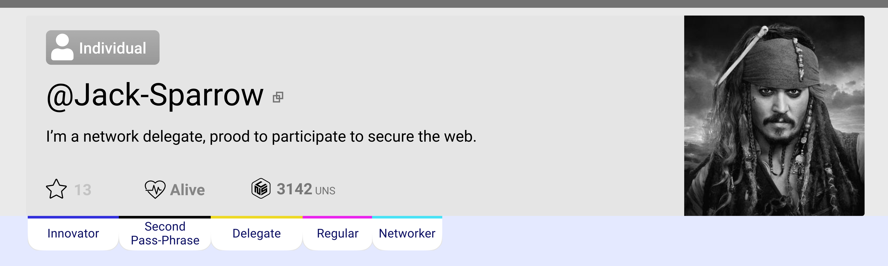
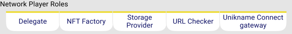
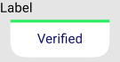
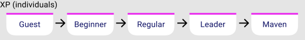
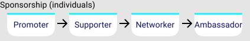

# Key Concept: DID UNIK Badges

Each @unikname is assigned trust badges. They provide information on the qualities of each DID UNIK NFT and its involvement in the network.

<small>_example of badges displayed in the header section of @jack-sparrow_</small>

Badges take the form of On-Chain properties and are always Disclosed, regardless of the visibility of the UNIK.

The badges are accessible with the Resolver within the path "Badges/".

There are two types of badges, singular ones and enumerated ones, belonging to families.

The badges are returned by the APIs, the CLI, and are visible on the chain explorer.

## Why Badges?

**Badges contribute to build trust in the network**. They give indications on the quality and legitimacy of each @unikname.

## Badge List

Badge Type: boolean

| Name | How to get it | Description | Scope | 
|-|-|-|-|
| **Second Passphrase** | forging the second passphrase transaction  | The UNIK is attached to a wallet with a second passphrase | all types | 
| **Multisig** | forging the multisig transaction | The UNIK is owned by a multisig cryptoaccount | all types | 

---

Badge Type: boolean

| Name | How to get it | Description | Scope | 
|-|-|-|-|
| **Delegate** | forging the delegate registration transaction | The cryptoaddress of the UNIK is registered as Delegate | all types |
| **Storage Provider** | Getting licence* | The UNIK is related to a Network Service Provider having a Storage Provider Licence. | all types |
| **NFT Factory** | Getting licence* | The UNIK is related to a Network Service Provider having a NFT Factory licence. The UNIK is enable to issue UNIK NFT Token. | organization only |
| **Unikname Connect Gateway** | Getting licence* | The UNIK is related to a Network Service Provider having a Unikname Connect licence. The UNIK is enable to provide authentication certificate. | organization only |
| **URL Checker** | Getting licence* | The UNIK is related to a Network Service Provider having a URL Checker licence. The UNIK is enable to check the ownership of a web ressource like a website. | organization only |

_* Licences are provided by the uns foundation_

---

Badge Type: enumerate

| Name | How to get it | Description | Scope
|-|-|-|-|
| **Innovator** | Claim | There is less than 1 500 UNIK created in the chain when the badge is claimed. | individual only
| **Early Adopter** | Claim | There is less than 150 000 UNIK created in the chain when the badge is claimed. | individual only

---

Badge Type: boolean

| Name | How to get it | Description | scope 
|-|-|-|-|-|
| **Verified** | my-unikname App, with a coupon | The @unikname owner has provided contact information that have been verified | Organization only 

---

Badge Type: enumerate

| Name | How to get it | Description | Scope |
|-|-|-|-|-|
| **Guest** | Minting the UNIK | The UNIK has just been minted. | individual only
| **Beginner** | Claim within the App | - the @unikname has his passphrase backup,   - it has been created for 10000 blocks ago or more (~24h)   - has invited one other member   - have made a first connection | individual only
| **Regular** | Claim within the App | 10 connections, or 10 transactions, or 10 contributions  | individual only
| **Leader** | Claim within the App | Has setup personnal properties and has contributed to each Network Service Providers | individual only
| **Maven** | Claim within the App |  Leader since 12 months | individual only

---

Type: enumerate

| Name | How to get it  | Description | Scope |
|-|-|-|-|-|
| **Promoter** | via sponsoring features | has invited 7 other user | individual only
| **Supporter** | via sponsoring features | has invited 7 users who created their @unikname becoming alive | individual only
| **Networker** | via sponsoring features | has invited 49 users who created their @unikname  becoming alive | individual only
| **Ambassador** | via sponsoring features | have been sponsor for 350 @unikname becoming alive | individual only
