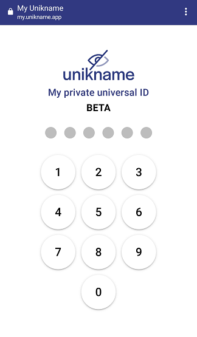
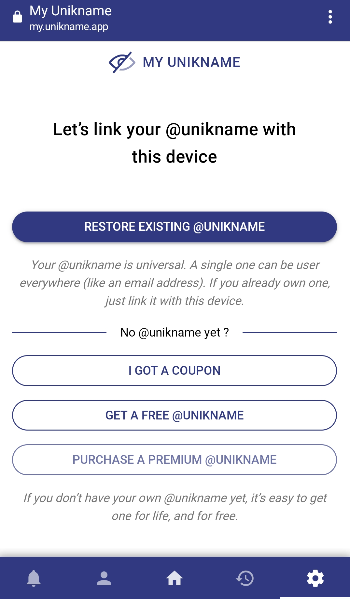
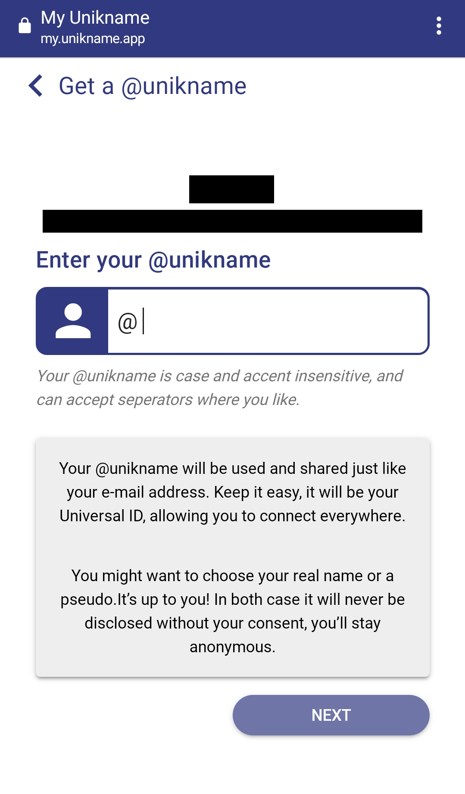

# Creating @unikname as an individual

[[toc]]

## Coupon

You can create @unikname with a minium of 15 characters for free.

If you want to create special @unikname with less than 15 charaters, it requires a coupon. and if you have one, you can continue. 

Otherwise, contact us on [contact@unikname.com](mailto:contact@unikname.com) to request one.

## Install the "My Unikname App"

The creation of your @unikname is done through [My Unikname App](https://my.unikname.app/).
To launch the application, follow this link with your **Android phone** (**and your phone only**):

👉 [https://my.unikname.app/](https://my.unikname.app/).

::: warning iOS users (iPhone or iPad)
If you are on iOS, contact us directly on [contact@unikname.com](mailto:contact@unikname.com).
:::

Once the application is installed on your home screen, launch the application and follow the steps displayed on your screen.

One of the first steps you will be asked is to create your pin code.
It is this code that will allow you to access the application later and manage your @unikname.

## Create your @unikname

On the next screen, choose the option that corresponds to your situation depending on whether you have a coupon ("I GOT A COUPON") or not ("GET A FREE @UNIKNAME").

After you choose your option, you should arrive on a page to create your @unikname!

:::tip
*Once you've chosen a name, you won't be able to change it. So choose it carefully!*
:::

Don't forget to backup and secure your passphrase, it will allow you to retrieve access to your @unikname in case you change your device.
Neither <uns/>, nor Unikname will be able to give you back access to your @unikname.
